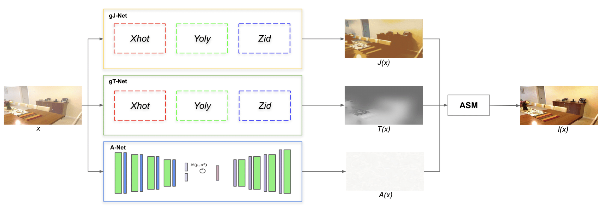

# XYZ Unsupervised Network: A Robust Image Dehazing Approach

> **Abstract:** 
In this work, we examine a major less-explored topic in image dehazing neural networks, specifically how to remove haze (natural phenomenon) in an unsupervised manner from a given image. By considering a hazy image as the entanglement of many "simpler" layers, such as a hazy-free image layer, transmission map layer, and atmospheric light layer, as shown in the atmospheric scattering model, we propose a method based on the concept of layer disentanglement. Our XYZ approach presents improvements in the SSIM and PSNR metrics, this being the combination of the XHOT, YOLY and ZID methods, in which the advantages of each of them are maintained. The main benefits of the proposed XYZ are twofold. First, since it is an unsupervised approach, no clean photos, including hazy-clear pairs, are used as the ground truth. In other words, it differs from the traditional paradigm of deep model training on a large dataset. The second is to consider haze issues as being composed of several layers.

- [Paper](https://www.scitepress.org/Papers/2024/123834/)

## Notes
1. Send email to maldonadoq.percy@gmail.com if you have critical issues to be addressed.

## Citation

If you find this work useful for your research, please cite our paper:

```bibtex
@conference{Maldonado2024,
  author={Percy Maldonado-Quispe and Helio Pedrini},
  title={XYZ Unsupervised Network: A Robust Image Dehazing Approach},
  booktitle={Proceedings of the 19th International Joint Conference on Computer Vision, Imaging and Computer Graphics Theory and Applications - Volume 3: VISAPP},
  year={2024},
  pages={500-507},
  publisher={SciTePress},
  organization={INSTICC},
  doi={10.5220/0012383400003660},
  isbn={978-989-758-679-8},
}
```
